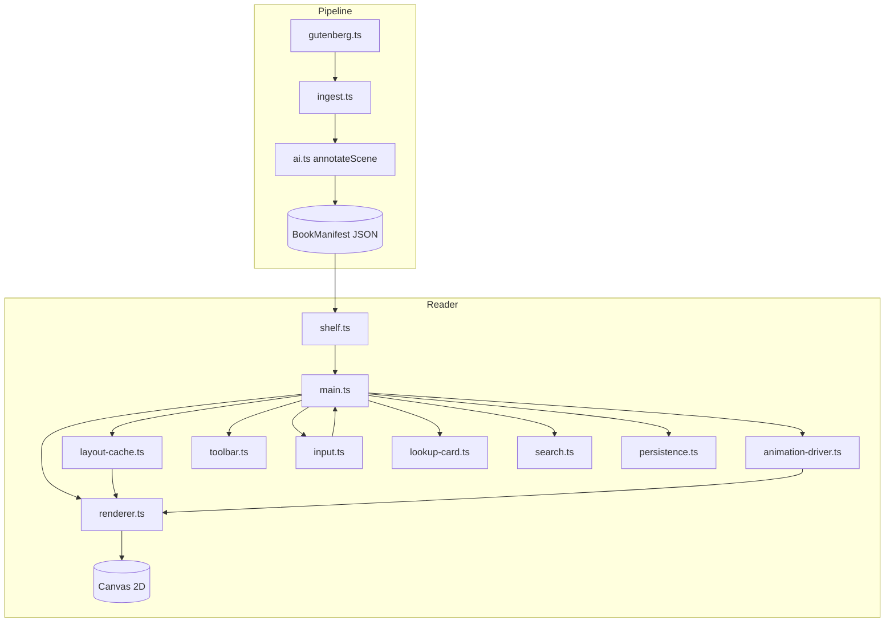
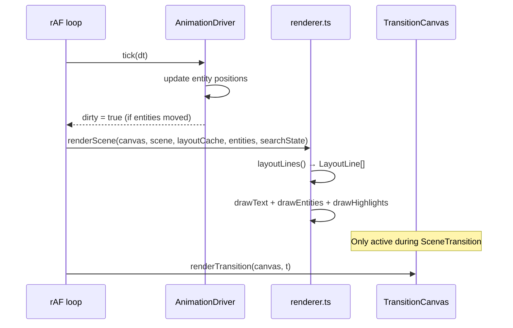

# Design Document: ai enhanced ebook reader Reader Redesign

## Overview

This redesign transforms LiquidFlow from a proof-of-concept canvas reader (single draggable orb, ASCII side panel, random-entity lore card) into a fully-featured "ai enhanced ebook reader" reading application. The core creative differentiator — canvas-based animated text using `@chenglou/pretext` — is preserved and extended. New capabilities include proper book typography, Kindle-style reader controls, inline animated entities that displace text in real time, cinematic scene-transition animations, and an elegant word/entity lookup system.

The design is additive where possible: existing modules are refactored rather than deleted wholesale. The pipeline gains richer AI annotation; the reader gains new subsystems layered on top of the existing render loop.

---

## Architecture

### Module Map

```
reader/src/
  main.ts              ← REPLACE: new app shell, toolbar, overlay routing
  renderer.ts          ← REPLACE: TypographyRenderer with LayoutCache + word hit-test
  types.ts             ← EXTEND: new BookManifest fields, LayoutLine, InlineEntity, etc.
  style.css            ← EXTEND: toolbar, LookupCard, overlays, search highlight
  ai.ts                ← KEEP: add lookupText() for drag-select AI call
  shelf.ts             ← KEEP: minor type update for new BookManifest shape
  demo-book.ts         ← KEEP: update to new BookManifest shape
  ascii.ts             ← REMOVE: functionality absorbed into transition.ts
  marginalia.ts        ← REMOVE: replaced by lookup-card.ts

  layout-cache.ts      ← NEW: LayoutCache keyed by (sceneId, fontSize)
  animation-driver.ts  ← NEW: InlineEntity lifecycle + SceneTransition trigger
  transition.ts        ← NEW: fluid-smoke and typographic-ascii renderers
  lookup-card.ts       ← NEW: LookupCard DOM component (entity + AI modes)
  search.ts            ← NEW: in-book search scan + highlight state
  toolbar.ts           ← NEW: toolbar DOM component + font size / chapter controls
  input.ts             ← NEW: unified touch/mouse/keyboard event router
  persistence.ts       ← NEW: localStorage helpers for position + fontSize

pipeline/src/
  ai.ts                ← EXTEND: annotateScene returns animationHints + entity manifest
  gutenberg.ts         ← KEEP
  ingest.ts            ← EXTEND: write entityManifest to BookManifest output
```

### High-Level Data Flow



### Render Loop Architecture

The render loop uses a **dirty-flag** pattern. A single `requestAnimationFrame` loop runs continuously; it only calls the renderer when `dirty === true`. State mutations set `dirty = true`.

Two canvas layers handle the transition animation without blocking the main text path:

- **Main canvas** (`#reader-canvas`): text, inline entities, search highlights
- **Transition canvas** (`#transition-canvas`): overlaid full-screen, `pointer-events: none`, shown only during `SceneTransition`



---

## Components and Interfaces

### toolbar.ts

Renders a Kindle-style bottom toolbar as a DOM overlay above the canvas. On touch devices all buttons are ≥44×44px.

```typescript
interface ToolbarCallbacks {
  onFontIncrease(): void
  onFontDecrease(): void
  onSearchOpen(): void
  onChapterListOpen(): void
  onBack(): void
}

function createToolbar(container: HTMLElement, callbacks: ToolbarCallbacks): {
  setChapterTitle(title: string): void
  setProgress(fraction: number): void  // 0–1
  destroy(): void
}
```

The toolbar HTML structure:
```
.reader-toolbar
  .toolbar-left   [← back]
  .toolbar-center [chapter title · progress %]
  .toolbar-right  [A- | A+ | 🔍 | ≡]
```

### lookup-card.ts

A CSS-positioned floating overlay. Two modes share the same DOM element:

```typescript
type LookupMode = 'entity' | 'ai-loading' | 'ai-result' | 'ai-error'

interface LookupCardState {
  mode: LookupMode
  title: string
  body?: string
  anchorX: number   // canvas-relative px
  anchorY: number   // canvas-relative px
}

function showLookupCard(state: LookupCardState): void
function hideLookupCard(): void
function updateLookupCard(partial: Partial<LookupCardState>): void
```

Positioning logic: the card is placed above the anchor point if there is room (canvas height − anchorY > 240px), otherwise below. Horizontally clamped to keep it within the viewport. Max 320×240px with `overflow-y: auto`.

### search.ts

```typescript
interface SearchMatch {
  chapterIndex: number
  sceneIndex: number
  charOffset: number   // byte offset within scene text
  length: number
}

interface SearchState {
  query: string
  matches: SearchMatch[]
  currentIndex: number
}

function searchBook(manifest: BookManifest, query: string): SearchState
function nextMatch(state: SearchState): SearchState
function prevMatch(state: SearchState): SearchState
```

The renderer receives the active `SearchMatch` for the current scene and renders matched text in `--accent` colour by splitting the line at the match boundaries during `materializeLineRange`.

### input.ts

Unified event router that classifies gestures and emits semantic events:

```typescript
type InputEvent =
  | { type: 'tap';    x: number; y: number }
  | { type: 'drag-start'; x: number; y: number }
  | { type: 'drag-move';  x: number; y: number }
  | { type: 'drag-end';   x: number; y: number }
  | { type: 'scroll';     deltaY: number }
  | { type: 'pinch';      scaleDelta: number }
  | { type: 'key';        key: string; modifiers: string[] }

function attachInputRouter(
  canvas: HTMLCanvasElement,
  onEvent: (e: InputEvent) => void
): () => void   // returns detach function
```

Tap vs drag discrimination: a pointer-down that moves < 10px and lifts within 200ms is a `tap`; otherwise it becomes a `drag-*` sequence.

### persistence.ts

```typescript
interface ReadingPosition {
  bookId: string
  chapterIndex: number
  sceneIndex: number
  scrollOffset: number
}

function savePosition(pos: ReadingPosition): void          // debounced 500ms
function loadPosition(bookId: string): ReadingPosition | null
function saveFontSize(size: number): void
function loadFontSize(): number                            // default 18
```

---

## Data Models

### Extended BookManifest (types.ts)

```typescript
export interface AnimationHints {
  mood: string                  // one word: "tense" | "melancholic" | "wonder" | ...
  visualPrompt: string          // ≤15 words for transition art
  entities: string[]            // up to 5 named strings
  transitionStyle: 'fluid-smoke' | 'typographic-ascii' | 'particle-drift'
}

export interface BookScene {
  id: string
  text: string
  // Legacy fields kept for backward compat:
  mood: string
  visualPrompt: string
  entities: string[]
  // New:
  animationHints: AnimationHints
}

export interface BookChapter {
  title: string
  scenes: BookScene[]
}

export interface EntityEntry {
  name: string
  type: 'character' | 'place' | 'theme'
  description: string           // ≤30 words, one sentence
  firstSeenScene: string        // scene ID
}

export interface BookManifest {
  id: string
  title: string
  author: string
  emoji: string
  chapters: BookChapter[]
  entityManifest: EntityEntry[] // top-level, new field
}
```

### TypographyConfig

```typescript
export interface TypographyConfig {
  fontSize: number        // 12–28, default 18
  lineHeight: number      // computed: fontSize * 1.6
  paddingX: number        // 48px or (canvasW - 680) / 2 when wide
  paddingTop: number      // 32px
  maxColumnWidth: number  // 680px
  font: string            // `${fontSize}px Lora, Georgia, serif`
  headingFont: string     // `bold ${Math.round(fontSize * 1.6)}px Lora, Georgia, serif`
}

function makeTypographyConfig(fontSize: number, canvasWidth: number): TypographyConfig
```

### LayoutCache (layout-cache.ts)

The cache is the central performance mechanism. It stores the expensive `prepareWithSegments` result and the per-line layout array for each `(sceneId, fontSize)` pair.

```typescript
export interface LayoutLine {
  x: number
  y: number           // top of line in content space (not screen space)
  w: number           // available width used for this line
  text: string        // materialized string
  startCursor: LayoutCursor
  endCursor: LayoutCursor
  words: WordBound[]  // word-level hit boxes within this line
}

export interface WordBound {
  word: string
  x: number   // relative to line.x
  w: number
}

type CacheKey = `${string}:${number}`  // `${sceneId}:${fontSize}`

export class LayoutCache {
  private prepared = new Map<CacheKey, PreparedTextWithSegments>()
  private lines    = new Map<CacheKey, LayoutLine[]>()

  getPrepared(sceneId: string, fontSize: number): PreparedTextWithSegments | undefined
  setPrepared(sceneId: string, fontSize: number, p: PreparedTextWithSegments): void

  getLines(sceneId: string, fontSize: number): LayoutLine[] | undefined
  setLines(sceneId: string, fontSize: number, lines: LayoutLine[]): void

  invalidateScene(sceneId: string): void   // called when font size changes
  clear(): void
}
```

**Cache invalidation**: when font size changes, `invalidateScene` is called for the current scene only (other scenes are lazily re-computed on demand). The `prepared` result is font-dependent because `prepareWithSegments` takes the font string.

### InlineEntity (animation-driver.ts)

```typescript
export interface InlineEntity {
  id: string
  name: string          // entity name string, rendered as text
  x: number             // current canvas x (logical px)
  y: number             // current canvas y (logical px)
  vx: number            // velocity x px/frame
  vy: number            // velocity y px/frame
  width: number         // measured via ctx.measureText
  height: number        // = lineHeight
  phase: number         // oscillation phase for sinusoidal path
  mood: string          // inherited from scene
}
```

**Mood → movement parameters**:

| mood | speed (px/frame) | path | amplitude |
|------|-----------------|------|-----------|
| melancholic | 0.4–0.8 | gentle sine wave | 20px |
| wonder | 0.6–1.0 | wide arc | 40px |
| tense | 1.5–2.5 | erratic zigzag | 10px |
| ominous | 0.3–0.6 | slow drift | 30px |
| joyful | 1.2–1.8 | bouncy sine | 35px |
| neutral | 0.8–1.2 | straight drift | 15px |

Entities wrap at canvas edges (bounce off left/right, re-enter from opposite side top/bottom).

### SceneTransition (transition.ts)

```typescript
export interface TransitionState {
  style: 'fluid-smoke' | 'typographic-ascii' | 'particle-drift'
  visualPrompt: string
  progress: number      // 0–1, driven by elapsed time / duration
  duration: number      // ms, 2000–5000
  startTime: number     // performance.now() at trigger
  offscreen: OffscreenCanvas | HTMLCanvasElement
}
```

---

## Animation Systems

### InlineEntity Animation

**Spawning**: when a scene loads, `AnimationDriver.spawnEntities(scene)` creates 1–3 `InlineEntity` objects from `scene.animationHints.entities`. Each entity's initial position is randomised along the top edge of the canvas.

**Per-frame update** (`AnimationDriver.tick(dt)`):
1. Update `x += vx * dt`, `y += vy * dt`
2. Apply sinusoidal lateral drift: `x += Math.sin(phase + t * freq) * amplitude`
3. Increment `phase`
4. Bounce off canvas edges

**Text displacement**: the renderer calls `getEntityObstacles()` which returns the current bounding boxes of all entities. For each line being laid out, the renderer checks if any entity's bounding box overlaps the line's y-range and computes the horizontal intrusion, then narrows `lineW` passed to `layoutNextLineRange` accordingly (same logic as the existing orb, but per-entity).

**Entity rendering**: each entity is drawn as its name string in `--font-mono` at `fontSize * 0.85`, coloured `--accent` with a subtle glow shadow. The entity is drawn after the text pass so it sits visually on top.

**Tap detection**: after layout, `main.ts` checks tap coordinates against each entity's bounding box (with 8px padding). If hit, `LookupCard` opens in `entity` mode using `EntityManifest` data — no AI call.

### SceneTransition Renderer

Both styles use an **offscreen canvas** that is composited onto the transition canvas each frame using `ctx.drawImage(offscreen, 0, 0)`.

#### fluid-smoke style

A 2D velocity grid (64×64 cells) drives a particle field of text characters:

1. **Velocity grid**: each cell has `(vx, vy)` updated each frame with curl noise (approximated via two offset sine waves). Grid resolution: 64×64.
2. **Particles**: 400–600 particles, each carrying a single character sampled from `visualPrompt` words. Position updated by sampling the velocity grid via bilinear interpolation.
3. **Rendering**: each particle is drawn with `ctx.fillText(char, px, py)` in `--text-primary` at varying opacity (0.2–0.9) based on particle age. Canvas is not cleared each frame — instead `ctx.fillRect` with `rgba(14,13,11, 0.08)` creates a motion-blur trail.
4. **Pretext usage**: `prepareWithSegments` + `layoutNextLineRange` are used to measure character widths for the particle characters, ensuring proportional spacing even in the smoke field.

#### typographic-ascii style

A brightness-sampled character grid:

1. **Source image**: a 160×90 virtual "image" is synthesised from the `visualPrompt` using a procedural noise function (no actual image fetch). Brightness per cell is `noise(x * 0.1, y * 0.1, t * 0.02)`.
2. **Character mapping**: brightness 0→1 maps to the density ramp `' ·.:;+*#@█'` (10 chars). Characters are drawn in a monospace grid using `--font-mono` at 8px.
3. **Animation**: the noise `t` parameter advances each frame, causing the character grid to shimmer and evolve.
4. **Pretext usage**: `prepareWithSegments` with the mono font measures the exact cell width for the grid, ensuring the grid fills the canvas precisely.

#### Compositing

```
transition canvas (position: absolute, inset: 0, z-index: 5)
  opacity: 0 → 1 (CSS transition, 300ms) on trigger
  opacity: 1 → 0 (CSS transition, 300ms) on completion
  pointer-events: none (always)
```

The transition canvas is a sibling of the main canvas in the DOM. When a transition starts, `main.ts` sets its opacity to 1 and starts the `TransitionState` timer. The rAF loop renders the transition each frame. When `progress >= 1` or the user taps, the transition canvas fades out and the next scene is loaded.

### Word Hit-Testing

After each full layout pass, `renderer.ts` returns the `LayoutLine[]` array. This is stored in `LayoutCache` and also kept in a frame-local reference in `main.ts` as `currentLines`.

**Tap → word lookup**:
```
1. Receive tap at (tapX, tapY) in canvas logical coordinates
2. Adjust for scrollOffset: contentY = tapY + scrollOffset
3. Binary search currentLines by line.y to find candidate lines
4. For each candidate line where contentY ∈ [line.y, line.y + lineHeight]:
   a. Walk line.words[]
   b. For each word: wordAbsX = line.x + word.x
   c. If tapX ∈ [wordAbsX, wordAbsX + word.w]: → matched word
5. Check matched word against entityManifest names (case-insensitive)
6. If entity match → open LookupCard in entity mode
7. Else → no action (tap on non-entity word)
```

**Word boundary computation** (done during layout, stored in `LayoutLine.words[]`):
After `materializeLineRange` returns the line text, the renderer iterates the text splitting on spaces and measures each word's width using `ctx.measureText`. Cumulative x offsets are stored in `WordBound[]`.

### Drag-to-Select

Selection state is tracked in `main.ts`:

```typescript
interface SelectionState {
  active: boolean
  startLine: number    // index into currentLines
  startWordIdx: number
  endLine: number
  endWordIdx: number
  text: string         // extracted selected text
}
```

**Drag gesture → selection**:
1. `drag-start` at (x, y): hit-test to find start line + word, set `selectionState.active = true`
2. `drag-move`: hit-test to find end line + word, update `selectionState.end*`, set `dirty = true`
3. `drag-end`: extract selected text by walking `currentLines[startLine..endLine]` and concatenating words; open `LookupCard` in `ai-loading` mode; fire AI request

**Highlight rendering**: during the text draw pass, for each line in `[startLine, endLine]`, the renderer draws a `--accent-glow` filled rectangle behind the text for the selected word range before drawing the text characters.

**Text extraction**: words from `startWordIdx` on `startLine` through `endWordIdx` on `endLine` are joined with spaces. The surrounding scene context (up to 400 chars centred on the selection) is passed to the AI call.

---

## LookupCard Design

The `LookupCard` is a CSS `position: absolute` element inside `#app`, layered above the canvas via `z-index: 30`.

```html
<div id="lookup-card" class="lookup-card hidden" role="dialog" aria-modal="true">
  <button class="lookup-close" aria-label="Close">×</button>
  <div class="lookup-title"></div>
  <div class="lookup-body">
    <!-- spinner OR text content -->
  </div>
</div>
```

CSS:
```css
.lookup-card {
  position: absolute;
  max-width: 320px;
  max-height: 240px;
  overflow-y: auto;
  background: var(--bg-elevated);
  border: 1px solid var(--accent-dim);
  border-radius: var(--radius);
  padding: 16px 20px;
  box-shadow: 0 8px 40px rgba(0,0,0,0.6), 0 0 0 1px var(--accent-glow);
  z-index: 30;
  animation: lookupIn 150ms ease;
}
.lookup-card.hidden { display: none; }
@keyframes lookupIn {
  from { opacity: 0; transform: translateY(8px); }
  to   { opacity: 1; transform: translateY(0); }
}
```

Dismissal: click outside (document `pointerdown` listener that checks `!card.contains(target)`), Escape key, or close button.

---

## Toolbar Redesign

The existing `.reader-nav` is replaced by `.reader-toolbar` — a bottom-anchored bar on mobile/tablet, top-anchored on desktop (detected via `window.innerWidth > 768`).

```
┌─────────────────────────────────────────────────────┐
│ ← back   Chapter III · 34%          A-  A+  🔍  ≡  │
└─────────────────────────────────────────────────────┘
```

- `A-` / `A+`: font size decrease/increase (2px steps, 12–28px range)
- `🔍`: opens search overlay
- `≡`: opens chapter list overlay

**Chapter list overlay**: a `position: fixed` panel with `z-index: 25`, listing all chapter titles. The active chapter is highlighted with `--accent` colour. Clicking outside or pressing Escape closes it.

**Search overlay**: a `position: fixed` panel with a text input, "no results" state, and next/prev match buttons. Opened by `🔍` or `Ctrl+F` / `Cmd+F`.

---

## Pipeline Changes

### Extended `annotateScene` (pipeline/src/ai.ts)

```typescript
export interface SceneAnnotation {
  mood: string
  visualPrompt: string
  entities: string[]
  transitionStyle: 'fluid-smoke' | 'typographic-ascii' | 'particle-drift'
}

// Default fallback when Ollama is unreachable:
const DEFAULT_ANNOTATION: SceneAnnotation = {
  mood: 'neutral',
  visualPrompt: 'atmospheric literary scene',
  entities: [],
  transitionStyle: 'particle-drift'
}
```

### Entity Manifest Generation (pipeline/src/ingest.ts)

After all scenes are annotated, `ingest.ts` collects all unique entity names across scenes, deduplicates them (keeping earliest scene), then calls `generateEntityDescription(name, firstSceneText)` using `MainModel` for each unique entity. The result is written as `entityManifest` at the top level of the `BookManifest` JSON.

```typescript
async function buildEntityManifest(
  chapters: BookChapter[],
  ollamaBase: string,
  mainModel: string
): Promise<EntityEntry[]>
```

---

## Error Handling

| Scenario | Behaviour |
|---|---|
| Ollama unreachable during pipeline ingestion | Write `DEFAULT_ANNOTATION`, log warning, continue |
| Ollama unreachable during AI lookup | Show "AI lookup unavailable — check Ollama connection" in LookupCard |
| AI request aborted (card dismissed) | `AbortController.abort()`, swallow `AbortError` |
| `prepareWithSegments` called with empty text | Guard: return empty `LayoutLine[]`, render nothing |
| Font size at min/max boundary | Clamp silently, disable the relevant toolbar button |
| No saved reading position | Start at chapter 0, scene 0, offset 0 |
| `entityManifest` missing from older BookManifest | Treat as empty array; entity tap falls through to AI lookup |
| SceneTransition canvas not supported (OffscreenCanvas unavailable) | Fall back to regular `HTMLCanvasElement` for the transition layer |
| Search query empty | Show validation hint "Enter a search term", do not scan |

---

## Testing Strategy

### Unit Tests

Focus on pure functions and edge cases:

- `makeTypographyConfig`: verify `lineHeight`, `paddingX`, `maxColumnWidth` clamping
- `searchBook`: verify case-insensitive match, no-results case, multi-match ordering
- `nextMatch` / `prevMatch`: verify wrap-around at boundaries
- `savePosition` / `loadPosition`: verify round-trip through `localStorage` mock
- `buildEntityManifest`: verify deduplication keeps earliest scene
- `AnimationDriver` mood → speed mapping: verify each mood produces speed within documented range
- `LookupCard` positioning: verify card stays within viewport bounds for various anchor positions

### Property-Based Tests

Use a property-based testing library (e.g. `fast-check` for TypeScript). Each property test runs a minimum of 100 iterations.

**Tag format**: `// Feature: kindle-plus-reader-redesign, Property N: <property text>`

---

## Correctness Properties

*A property is a characteristic or behavior that should hold true across all valid executions of a system — essentially, a formal statement about what the system should do. Properties serve as the bridge between human-readable specifications and machine-verifiable correctness guarantees.*


### Property 1: Typography lineHeight invariant

*For any* valid font size in the range [12, 28], `makeTypographyConfig` should produce a `lineHeight` that is at least 1.5× the font size.

**Validates: Requirements 1.1**

---

### Property 2: First-line indent property

*For any* paragraph text laid out by the renderer, the first `LayoutLine` of each paragraph should have an `x` offset at least 1.5 × `fontSize` greater than the base `paddingX`, while subsequent lines in the same paragraph should have `x` equal to `paddingX`.

**Validates: Requirements 1.2**

---

### Property 3: Heading font size invariant

*For any* valid font size in the range [12, 28], `makeTypographyConfig` should produce a `headingFont` whose numeric size component is at least 1.6× the base font size.

**Validates: Requirements 1.4**

---

### Property 4: Column width clamping

*For any* canvas width, `makeTypographyConfig` should produce a `paddingX` such that the effective column width (`canvasWidth - 2 * paddingX`) never exceeds 680px.

**Validates: Requirements 1.7**

---

### Property 5: Font size clamping

*For any* current font size in [12, 28], applying an increase should produce `min(fontSize + 2, 28)` and applying a decrease should produce `max(fontSize - 2, 12)`. The result is always within [12, 28].

**Validates: Requirements 2.2, 2.3**

---

### Property 6: Font size persistence round-trip

*For any* valid font size in [12, 28], calling `saveFontSize(n)` followed by `loadFontSize()` should return `n`.

**Validates: Requirements 2.4, 2.5**

---

### Property 7: Search returns only matching scenes

*For any* `BookManifest` and any non-empty query string, every `SearchMatch` returned by `searchBook` should correspond to a scene whose text contains the query as a case-insensitive substring. No scene that does not contain the query should appear in the results.

**Validates: Requirements 3.2, 3.3**

---

### Property 8: Search match cycling round-trip

*For any* `SearchState` with N matches (N ≥ 1), calling `nextMatch` exactly N times starting from any index should return a state with the same `currentIndex` as the starting state.

**Validates: Requirements 3.5**

---

### Property 9: Chapter list completeness

*For any* `BookManifest`, the chapter list rendered by the toolbar should contain exactly the same chapter titles in the same order as `manifest.chapters.map(c => c.title)`.

**Validates: Requirements 4.2**

---

### Property 10: Entity spawn count

*For any* scene whose `animationHints.entities` array has length L (L ≥ 1), `AnimationDriver.spawnEntities(scene)` should return between 1 and `min(3, L)` `InlineEntity` objects.

**Validates: Requirements 5.1**

---

### Property 11: Entity line-width narrowing

*For any* `InlineEntity` whose bounding box overlaps a line's y-range, the `lineW` passed to `layoutNextLineRange` for that line should be strictly less than the full column width (`maxColumnWidth`).

**Validates: Requirements 5.3, 14.4**

---

### Property 12: Mood-to-speed mapping

*For any* mood string defined in the mood table (melancholic, wonder, tense, ominous, joyful, neutral), the speed assigned to a spawned `InlineEntity` should fall within the documented min–max range for that mood.

**Validates: Requirements 5.5**

---

### Property 13: Transition duration bounds

*For any* `TransitionState` created by `AnimationDriver`, the `duration` field should be in the range [2000, 5000] ms.

**Validates: Requirements 6.4**

---

### Property 14: No backward transition

*For any* backward navigation action (prevScene, prevChapter), `AnimationDriver` should not create a `TransitionState` — the transition trigger should only fire on forward chapter-boundary crossings.

**Validates: Requirements 6.6**

---

### Property 15: AnimationHints completeness

*For any* scene annotation produced by the pipeline's `annotateScene`, the returned `SceneAnnotation` object should have all four required fields: `mood` (non-empty string), `visualPrompt` (non-empty string, ≤15 words), `entities` (array), and `transitionStyle` (one of the three valid values).

**Validates: Requirements 7.1**

---

### Property 16: Word hit-test correctness

*For any* array of `LayoutLine` objects and any tap coordinate `(tapX, tapY)`, the word hit-test function should return the word whose bounding box contains the tap point, or `null` if no word's bounding box contains it. The result should be consistent: the same tap coordinates always return the same word for the same layout.

**Validates: Requirements 8.1, 9.7**

---

### Property 17: LookupCard content completeness

*For any* `EntityEntry`, the LookupCard rendered in entity mode should contain the entity's `name` and `description` as visible text content.

**Validates: Requirements 8.3**

---

### Property 18: LookupCard position constraint

*For any* anchor position `(anchorX, anchorY)` and canvas dimensions `(W, H)`, the computed card position should result in the card occupying no more than 40% of the canvas area (320 × 240 = 76,800 px² vs. any canvas ≥ 192,000 px²), and the card should be fully within the viewport bounds.

**Validates: Requirements 8.5**

---

### Property 19: Drag selection spans at least one word

*For any* drag gesture where the start and end coordinates both fall within the laid-out text area of a scene, the resulting `SelectionState` should have a non-empty `text` field containing at least one word.

**Validates: Requirements 9.1**

---

### Property 20: Tap vs drag classification

*For any* pointer-down/up sequence, the input router should classify it as a `tap` if and only if the total movement is < 10px AND the duration is < 200ms. All other sequences should be classified as `drag-*`.

**Validates: Requirements 11.3**

---

### Property 21: Reading position round-trip

*For any* `ReadingPosition` value, calling `savePosition(pos)` followed by `loadPosition(pos.bookId)` should return a position with identical `chapterIndex`, `sceneIndex`, and `scrollOffset` values.

**Validates: Requirements 12.1, 12.2**

---

### Property 22: Entity manifest deduplication

*For any* set of scenes containing entity names, `buildEntityManifest` should return exactly one `EntityEntry` per unique entity name (case-sensitive), and for entities appearing in multiple scenes, the `firstSeenScene` should be the ID of the scene with the lowest chapter/scene index.

**Validates: Requirements 13.1, 13.4**

---

### Property 23: EntityEntry field completeness

*For any* `EntityEntry` produced by the pipeline, all four fields (`name`, `type`, `description`, `firstSeenScene`) should be present, non-empty strings, with `type` being one of `character | place | theme`.

**Validates: Requirements 13.2**

---

### Property 24: BookManifest serialization round-trip

*For any* `BookManifest` containing an `entityManifest` array, serializing to JSON and deserializing should produce an object where `entityManifest` is present at the top level with the same entries.

**Validates: Requirements 13.5**

---

### Property 25: Layout correctness

*For any* scene text laid out by the renderer, the resulting `LayoutLine[]` array should satisfy: (a) each line's `startCursor` equals the `endCursor` of the previous line, (b) each line's `text` equals `materializeLineRange(prepared, layoutResult).text`, and (c) every line has all required fields (`x`, `y`, `w`, `text`, `startCursor`, `endCursor`, `words`) populated with non-null values.

**Validates: Requirements 14.2, 14.3, 14.5**

---

### Property 26: PrepareWithSegments cache hit

*For any* sequence of layout calls that includes two or more calls with the same `(sceneId, fontSize)` pair, `prepareWithSegments` should be invoked exactly once for that pair — subsequent calls should return the cached result.

**Validates: Requirements 14.1, 15.3**

---

## Testing Strategy

### Dual Testing Approach

Both unit tests and property-based tests are required. They are complementary:

- **Unit tests** cover specific examples, integration points, and error conditions
- **Property tests** verify universal invariants across randomly generated inputs

### Property-Based Testing

Use **`fast-check`** (TypeScript-native, no additional runtime dependencies beyond dev):

```
npm install --save-dev fast-check
```

Each property test runs a minimum of **100 iterations** (`numRuns: 100` in `fc.assert`).

Tag format for each test:
```typescript
// Feature: kindle-plus-reader-redesign, Property N: <property text>
```

Each correctness property above maps to exactly one `fc.assert(fc.property(...))` test.

Example structure:
```typescript
import * as fc from 'fast-check'
import { makeTypographyConfig } from '../src/layout-cache'

// Feature: kindle-plus-reader-redesign, Property 1: Typography lineHeight invariant
test('lineHeight is always >= 1.5x fontSize', () => {
  fc.assert(
    fc.property(fc.integer({ min: 12, max: 28 }), (fontSize) => {
      const config = makeTypographyConfig(fontSize, 1024)
      return config.lineHeight >= fontSize * 1.5
    }),
    { numRuns: 100 }
  )
})
```

### Unit Test Focus Areas

- `makeTypographyConfig`: specific values at boundaries (12px, 28px, 18px default)
- `searchBook`: empty manifest, single match, query with special regex chars
- `buildEntityManifest`: empty entity list, single entity, entity in all scenes
- `LookupCard` positioning: anchor at corners, anchor near edges
- `AnimationDriver.spawnEntities`: scene with 0 entities (should spawn 0), scene with 5 entities (should spawn ≤ 3)
- `annotateScene` fallback: mock fetch failure → verify default annotation returned
- `persistence.ts`: `loadPosition` when localStorage is empty → returns null
- Dirty-flag: render function call count when dirty=false vs dirty=true

### Test File Structure

```
reader/src/
  __tests__/
    typography.test.ts      ← Properties 1–4, unit tests for makeTypographyConfig
    font-size.test.ts       ← Properties 5–6
    search.test.ts          ← Properties 7–8, unit tests for searchBook
    chapter-nav.test.ts     ← Property 9
    animation-driver.test.ts ← Properties 10, 12–14
    renderer.test.ts        ← Properties 11, 25–26
    lookup-card.test.ts     ← Properties 17–18
    input.test.ts           ← Properties 19–20
    persistence.test.ts     ← Property 21
    word-hittest.test.ts    ← Property 16

pipeline/src/
  __tests__/
    ai.test.ts              ← Property 15, fallback example
    entity-manifest.test.ts ← Properties 22–24
```
